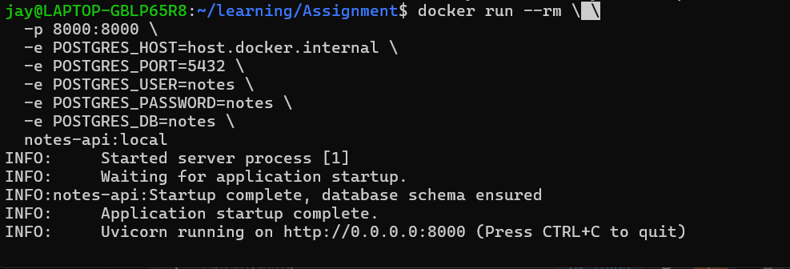
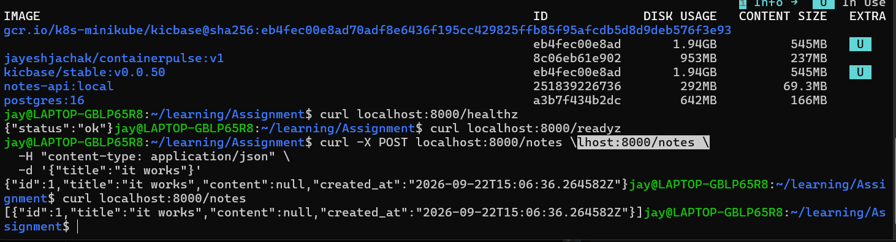

### Health Check Decision

I chose to omit the Docker `HEALTHCHECK` instruction and rely on Kubernetes-native liveness and readiness probes.

The application exposes two separate endpoints: `/healthz` for liveness and `/readyz` for readiness. This distinction is important because liveness determines whether the container should be restarted, while readiness determines whether the pod should receive traffic.

Using Kubernetes probes allows these two conditions to be handled independently. For example, if PostgreSQL becomes temporarily unavailable, `/readyz` can fail and Kubernetes can remove the pod from service traffic, while `/healthz` can continue to pass because the application process itself is still healthy. This avoids unnecessarily restarting the container during a temporary database outage.

A Docker `HEALTHCHECK` would provide a useful container-level health signal when running the image directly with Docker, but for the Kubernetes deployment targeted by this assignment, the native liveness and readiness probes provide the more appropriate lifecycle behavior.

